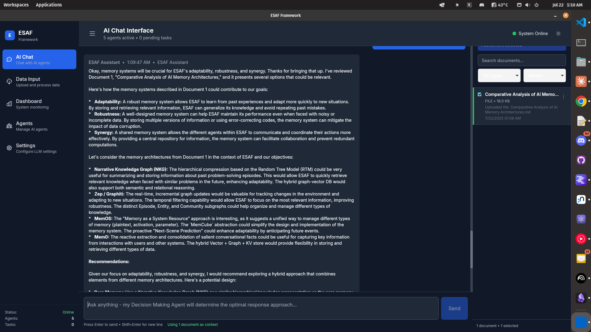

# ESAF Framework (Evolved Synergistic Agentic Framework)

Work in progress. AI gen code, use at own risk.

A sophisticated multi-agent cognitive system implementing asynchronous event-driven architecture for advanced AI coordination and decision-making.



## 🎯 Overview

The ESAF Framework represents an evolution in multi-agent system design, moving from traditional synchronous sequential processing to a dynamic, event-driven architecture. The system features specialized agents that communicate through a central **Cognitive Substrate**, enabling parallel processing, real-time adaptation, and emergent intelligence.

### Key Features

- **🧠 Cognitive Substrate**: Central event-driven communication bus
- **🤖 Specialized Agents**: Modular agents with distinct cognitive functions
- **⚡ Asynchronous Processing**: Non-blocking, parallel task execution
- **🎛️ Dynamic Orchestration**: Intelligent task routing and dependency management
- **🛡️ Governance Layer**: Ethical constraints and safety mechanisms
- **📊 Real-time Monitoring**: Live dashboard with agent status and event logging

## 🏗️ Architecture

### Core Components

1. **Cognitive Substrate** (`CognitiveSubstrate`)
   - Event-driven message bus using EventEmitter3
   - Pub/sub pattern for agent communication
   - Event history and filtering capabilities

2. **ESAF Orchestrator** (`ESAFOrchestrator`)
   - Task creation and distribution
   - Agent lifecycle management
   - System coordination and monitoring

3. **Base Agent Framework** (`BaseESAFAgent`)
   - Common agent contract and behavior
   - Event subscription management
   - Error handling and graceful shutdown

4. **Specialized Agents**
   - **Data Analysis Agent (DA)**: Bayesian data processing, validation, feature extraction
   - **Optimization Agent (OA)**: Linear programming, constraint formulation, algorithm selection
   - **Game Theory Agent (GT)**: Strategic analysis, equilibrium computation, conflict resolution
   - **Swarm Intelligence Agent (SI)**: Adaptive learning, emergent behavior, system optimization
   - **Decision Making Agent (DM)**: Multi-criteria analysis, stakeholder synthesis, final recommendations

### Agent Communication Flow

```
User Request → Orchestrator → Task Creation → Agent Assignment →
Processing → Event Publishing → Result Collection → Response
```

## 🧠 Dynamic Model Fetching

The ESAF Framework includes sophisticated dynamic model fetching capabilities that automatically discover and manage available models across all supported LLM providers.

### Supported Providers & Dynamic Discovery

| Provider | Discovery Method | Real-time Fetching |
|----------|------------------|-------------------|
| **Google Gemini** | `/v1beta/models` API | ✅ Live from Google |
| **LM Studio** | `/api/v0/models` REST | ✅ Local server |
| **Ollama** | `/api/tags` endpoint | ✅ Local models |
| **OpenAI** | `models.list()` SDK | ✅ Live from OpenAI |
| **Anthropic** | Known model list | 📋 Static catalog |

### Key Features

- **🔄 Real-time Discovery**: Fetches available models directly from provider APIs
- **💾 Intelligent Caching**: 5-minute TTL reduces API calls while staying current
- **🏥 Health Monitoring**: Tracks provider availability and latency
- **⚡ Bulk Operations**: Fetch from all providers simultaneously
- **🛡️ Error Resilience**: Graceful fallbacks when providers are unavailable

### Usage Example

```typescript
import { llmService, LLMProvider } from '@/core/llm-service';

// Get models for a specific provider
const models = await llmService.getModelsForProvider(LLMProvider.GOOGLE_GENAI);

// Check provider health
const status = await llmService.checkProviderStatus(LLMProvider.OLLAMA);

// Get all models from all providers
const allModels = await llmService.getAllModels();
```

### Testing Dynamic Models

```bash
node test-dynamic-models.js
```

See [DYNAMIC_MODEL_FETCHING.md](./DYNAMIC_MODEL_FETCHING.md) for comprehensive documentation.

## 🚀 Getting Started

### Prerequisites

- Node.js 18+ with npm/yarn
- Rust (for Tauri desktop app)
- UV package manager (preferred)

### Installation

1. **Clone and setup the project:**
   ```bash
   cd /home/ty/Repositories/ai_workspace/esaf-framework
   npm install
   ```

2. **Install Rust dependencies:**
   ```bash
   cd src-tauri
   cargo fetch
   cd ..
   ```

on Ubuntu systems you may need to install the following packages:

```bash
sudo apt install -y libwebkit2gtk-4.0-dev libgtk-3-dev librsvg2-dev patchelf libsoup2.4-dev
```

```bash
sudo apt install -y libayatana-appindicator3-dev
```

```bash
sudo apt update && sudo apt install -y libwebkit2gtk-4.1-dev libgtk-3-dev libayatana-appindicator3-dev librsvg2-dev libsoup-3.0-dev libjavascriptcoregtk-4.1-dev
```

If process left running:

```bash
pkill -f "npm run tauri:dev" && pkill -f "vite" && sleep 2
```

3. **Development server:**
   ```bash
   npm run tauri:dev
   ```

4. **Build for production:**
   ```bash
   npm run tauri:build
   ```

### Quick Start Example

```typescript
import { frameworkInstance } from '@/core/orchestrator.js';
import { TaskPriority } from '@/core/types.js';

// Initialize the framework
await frameworkInstance.initialize();

// Create a data validation task
const taskId = await frameworkInstance.createTask(
  'data_validation',
  {
    dataSources: [
      {
        id: 'source-1',
        type: 'api',
        status: 'verified',
        lastUpdated: Date.now(),
        reliability: 0.8
      }
    ]
  },
  TaskPriority.HIGH
);

// Monitor results
const result = frameworkInstance.getResult(taskId);
console.log('Analysis result:', result);
```

### Complete ESAF Workflow Example

```typescript
// Execute a complete multi-agent analysis workflow
const workflowResults = await frameworkInstance.executeCompleteWorkflow(
  {
    // Your data to analyze
    salesData: [100, 120, 95, 140, 160],
    customerFeedback: ["positive", "neutral", "positive"],
    marketConditions: { competition: "high", demand: "growing" }
  },
  [
    "Optimize sales performance",
    "Improve customer satisfaction",
    "Strategic market positioning"
  ],
  {
    constraints: ["budget < 100000", "timeline < 6months"],
    stakeholders: ["sales_team", "customers", "management"],
    riskTolerance: "moderate"
  }
);

console.log('Complete Analysis Results:', {
  dataInsights: workflowResults.dataAnalysis,
  optimizationPlan: workflowResults.optimization,
  strategicAnalysis: workflowResults.gameTheory,
  adaptiveLearning: workflowResults.swarmIntelligence,
  finalRecommendation: workflowResults.finalDecision
});
```

## 📋 Available Task Types

### Data Analysis Agent (DA)

- **`data_validation`**: Validate data sources using Bayesian confidence scoring
- **`feature_extraction`**: Extract statistical features from data objects
- **`anomaly_detection`**: Detect outliers and structural anomalies
- **`data_backup`**: Version and backup data with metadata
- **`intelligent_analysis`**: General intelligent data analysis for complex queries

### Optimization Agent (OA)

- **`constraint_formulation`**: Formulate mathematical constraints from problem descriptions
- **`algorithm_selection`**: Select optimal algorithms (Simplex, Genetic, Multi-objective)
- **`solve_optimization`**: Solve optimization problems using selected algorithms
- **`multi_objective_optimization`**: Handle multiple competing objectives with Pareto analysis
- **`constraint_relaxation`**: Relax infeasible constraints to find solutions

### Game Theory Agent (GT)

- **`strategy_formulation`**: Formulate optimal strategies for strategic interactions
- **`equilibrium_analysis`**: Calculate Nash, Stackelberg, and other equilibria
- **`conflict_resolution`**: Resolve conflicts between competing interests
- **`risk_assessment`**: Assess strategic risks and uncertainties
- **`coalition_analysis`**: Analyze coalition formation and stability
- **`mechanism_design`**: Design mechanisms for desired strategic outcomes

### Swarm Intelligence Agent (SI)

- **`adaptive_learning`**: Perform adaptive learning with dynamic parameter adjustment
- **`swarm_optimization`**: Run swarm algorithms (PSO, ACO, Tabu Search, Simulated Annealing)
- **`learning_rate_control`**: Control and adjust learning rates dynamically
- **`emergent_behavior_analysis`**: Analyze emergent behavior in multi-agent systems
- **`memory_retention`**: Optimize memory retention and forgetting mechanisms
- **`system_adaptation`**: Adapt entire system based on performance feedback

### Decision Making Agent (DM)

- **`decision_integration`**: Integrate inputs from all agents into cohesive decisions
- **`multi_criteria_analysis`**: Perform MCDA using various methods (Weighted Sum, TOPSIS, AHP)
- **`contingency_planning`**: Develop comprehensive contingency plans
- **`fallback_strategy`**: Create fallback strategies for critical failures
- **`stakeholder_synthesis`**: Synthesize inputs from multiple stakeholders
- **`final_recommendation`**: Generate final comprehensive recommendations

### Task Payload Examples

```typescript
// Data Validation
{
  dataSources: [
    {
      id: string,
      type: 'file' | 'api' | 'database' | 'stream',
      status: 'verified' | 'unverified' | 'error',
      lastUpdated: number,
      reliability: number // 0-1
    }
  ]
}

// Feature Extraction
{
  data: object,
  extractionMethod?: string
}

// Anomaly Detection
{
  data: unknown[] | object
}

// Optimization - Algorithm Selection
{
  problemType: string,
  constraints: OptimizationConstraint[],
  variables: OptimizationVariable[],
  objectives: string[],
  complexity?: 'low' | 'medium' | 'high'
}

// Game Theory - Strategy Formulation
{
  scenario: string,
  players: GamePlayer[],
  objectives: Record<string, string>,
  constraints?: string[],
  informationStructure?: string
}

// Swarm Intelligence - Adaptive Learning
{
  performanceData: number[],
  currentParameters: LearningParameters,
  adaptationGoals: string[],
  constraints?: Record<string, any>
}

// Decision Making - Integration
{
  agentInputs: Record<string, any>,
  decisionContext: DecisionContext,
  criteria: DecisionCriteria[],
  alternatives: DecisionAlternative[],
  stakeholderInputs?: Record<string, any>
}
```

## 🎛️ Dashboard Interface

The React-based dashboard provides:

- **System Status**: Framework uptime, agent count, task metrics
- **Agent Monitoring**: Real-time agent status, algorithms, task queues
- **Task Management**: Create, monitor, and track task execution
- **Event Log**: Live system events with filtering and search
- **Interactive Controls**: Task creation, agent management

### Dashboard Components

- `Dashboard`: Main interface coordinator
- `AgentCard`: Individual agent status display
- `TaskList`: Task queue and history management
- `EventLog`: Real-time event monitoring

## 🔧 Configuration

### Framework Configuration

```typescript
const config = {
  maxConcurrentTasks: 10,
  eventHistoryLimit: 10000,
  defaultTaskTimeout: 30000
};

const orchestrator = new ESAFOrchestrator(config);
```

### Agent Algorithms

**Data Analysis Agent:**
- BayesianNetworks: Probabilistic inference
- AnomalyDetection: Statistical outlier detection
- DataNormalization: Data preprocessing
- DataVersioning: Backup and versioning

## 📊 Monitoring & Events

### Event Types

- `TASK_CREATED`: New task added to queue
- `TASK_STARTED`: Agent begins processing
- `TASK_COMPLETED`: Successful task completion
- `TASK_FAILED`: Task execution failure
- `DATA_VALIDATED`: Data source validation complete
- `ANOMALY_DETECTED`: Anomaly identified in data
- `CONSTRAINT_VIOLATION`: System constraint violated
- `AGENT_ERROR`: Agent-level error occurred

### Status Monitoring

```typescript
// Get framework status
const status = frameworkInstance.getStatus();
console.log({
  isRunning: status.isRunning,
  activeAgents: status.activeAgents,
  pendingTasks: status.pendingTasks,
  uptime: status.uptime
});

// Get agent information
const agents = frameworkInstance.getAgentInfo();
agents.forEach(agent => {
  console.log(`${agent.name}: ${agent.status}`);
});
```

## 🛡️ Safety & Governance

The ESAF framework implements multiple safety layers:

- **Type Safety**: Zod schema validation for all data structures
- **Error Isolation**: Agent failures don't cascade to other agents
- **Resource Management**: Task queue limits and timeout handling
- **Event Auditing**: Complete event history for system transparency

### Future Governance Features

- Constitutional AI constraints
- Ethical decision validation
- Stakeholder impact assessment
- Human-in-the-loop intervention points

## 🔮 Roadmap

### Phase 1 (Completed) - Foundation ✅
- ✅ Cognitive Substrate implementation
- ✅ Data Analysis Agent (DA)
- ✅ React Dashboard
- ✅ Event-driven architecture

### Phase 2 (Completed) - Agent Expansion ✅
- ✅ Optimization Agent (OA) - Linear programming, constraint optimization
- ✅ Game Theory Agent (GT) - Strategic analysis, equilibrium computation
- ✅ Swarm Intelligence Agent (SI) - Adaptive learning, emergent behavior
- ✅ Decision Making Agent (DM) - Multi-criteria analysis, final synthesis

### Phase 3 - Advanced Features (In Progress)
- 🔄 Governance Agent with veto power
- 🔄 Agent Foundry (dynamic agent creation)
- 🔄 Systemic World Model
- 🔄 Advanced constraint systems
- 🔄 Enhanced multi-agent workflows

### Phase 4 - Intelligence Emergence
- 🔄 Cross-agent learning
- 🔄 Adaptive workflow optimization
- 🔄 Emergent behavior analysis
- 🔄 Self-improving architecture

## 🤝 Development

### Project Structure

```
esaf-framework/
├── src/
│   ├── core/           # Framework core (substrate, orchestrator, types)
│   ├── agents/         # Agent implementations
│   ├── components/     # React UI components
│   └── main.tsx        # Application entry point
├── src-tauri/          # Tauri desktop app backend
├── public/             # Static assets
└── docs/               # Documentation
```

### Contributing

1. Follow the established agent interface (`IESAFAgent`)
2. Implement agents by extending `BaseESAFAgent`
3. Use TypeScript with strict type checking
4. Add comprehensive tests for new agents
5. Update documentation for new features

### Testing

```bash
npm run test           # Run Vitest tests
npm run test:ui        # Visual test runner
npm run lint           # ESLint checking
npm run format         # Prettier formatting
```

## 📄 License

MIT License - see LICENSE file for details.

## 🙏 Acknowledgments

This framework builds upon concepts from:
- Multi-agent systems research
- Event-driven architecture patterns
- Cognitive science principles
- Bayesian probabilistic modeling
- Constitutional AI safety research

---

**Built with:** TypeScript, React, Tauri, Vite, Tailwind CSS, EventEmitter3, Zod
